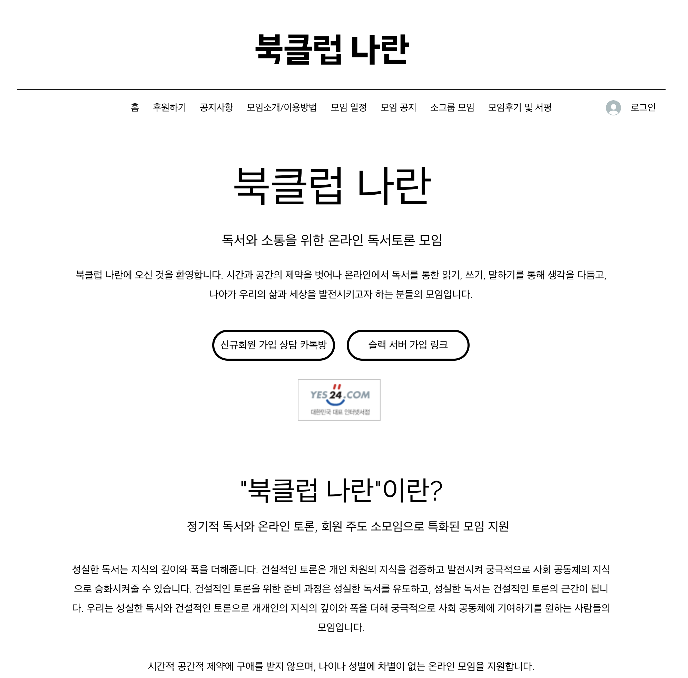
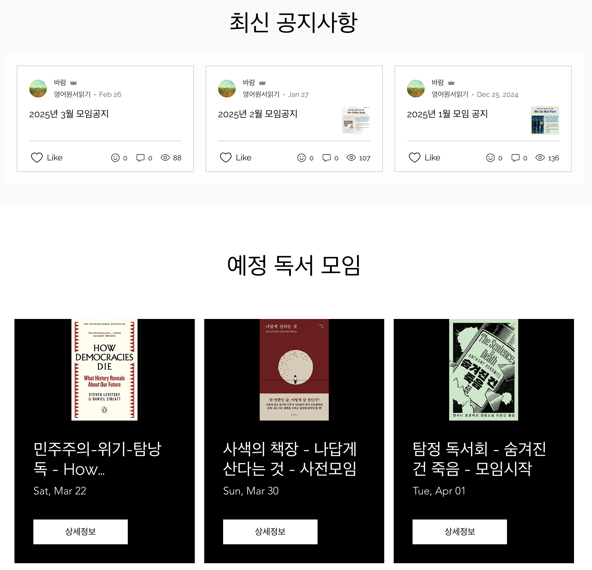
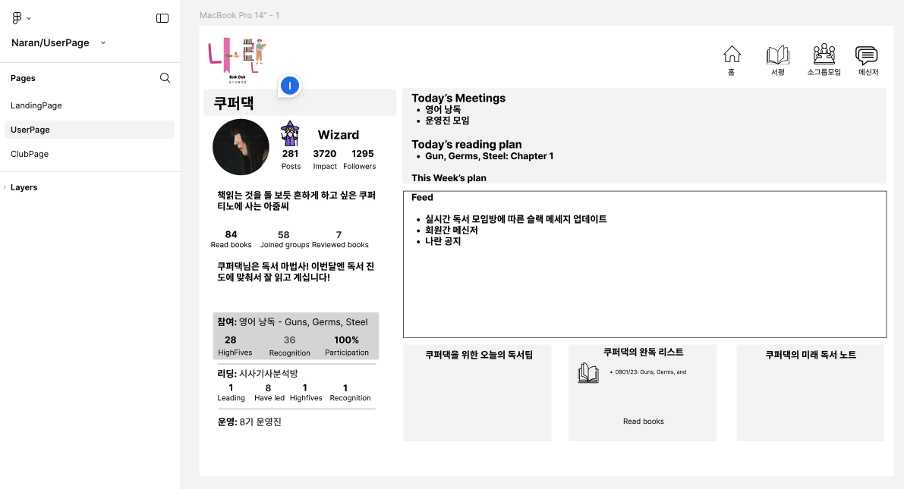
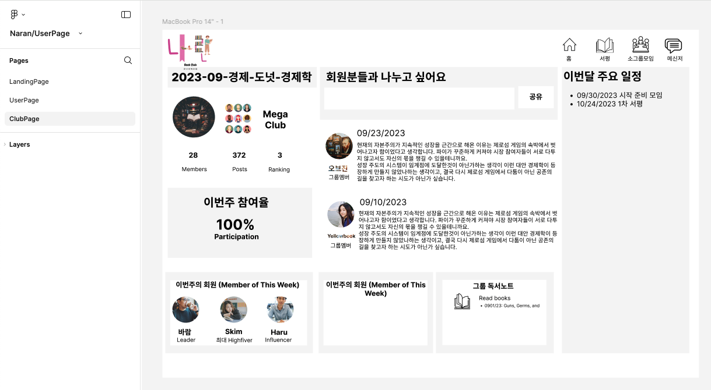
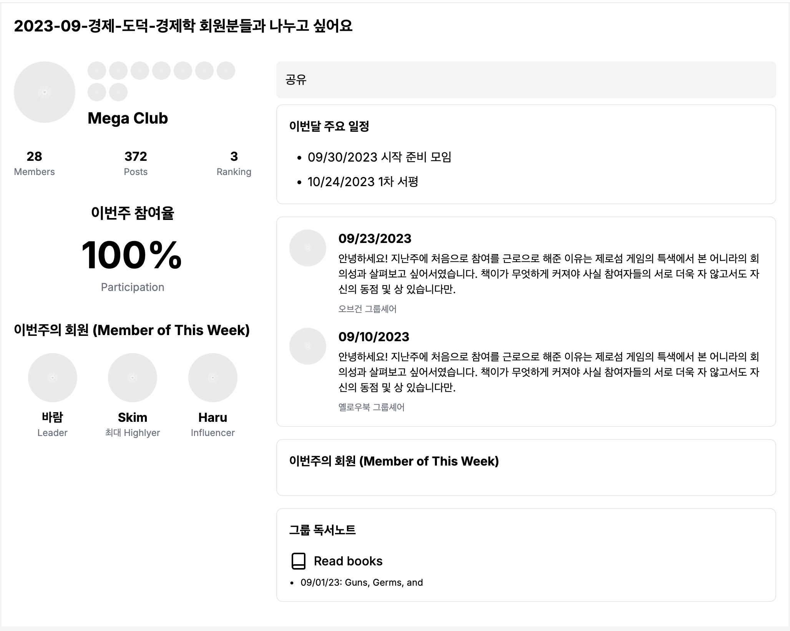
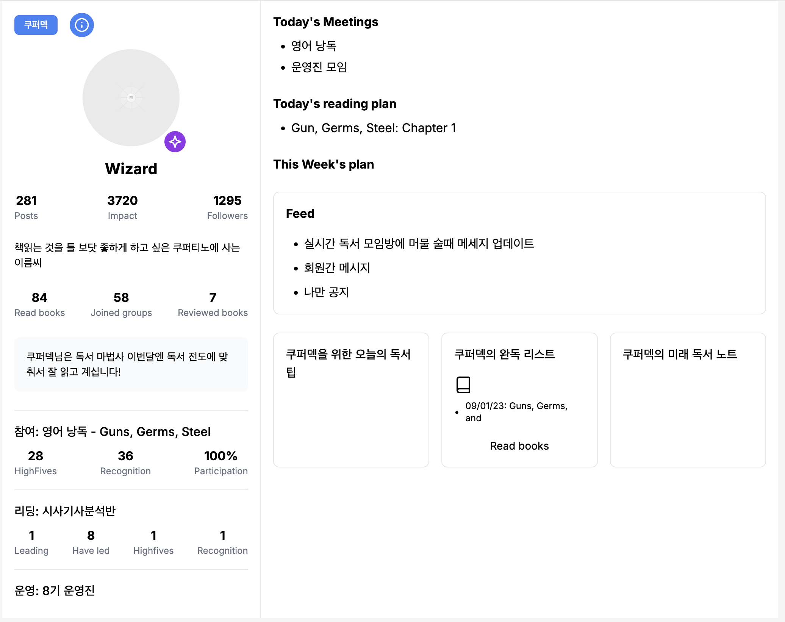

# Naran Redesign

The Naran Redesign project is focused on revamping the front-end experience of Naran, a prominent book club originally hosted on [Cyberseowon](https://www.cyberseowon.com/). Naran aims to provide an engaging, user-friendly platform for book enthusiasts to connect, discuss, and share their passion for literature.

This redesign initiative emphasizes:

- Enhanced User Interface (UI): A fresh, intuitive design that enhances the visual experience, ensuring seamless navigation.

- Improved User Experience (UX): Optimizing functionality and accessibility to improve overall usability across various devices.

- Modern Web Technologies: Leveraging the latest front-end frameworks and tools to create a fast, responsive, and dynamic platform.

Scalability: Building a solution that can easily scale as the user base grows and the platform evolves.

This project will deliver an updated front-end solution that aligns with modern web standards, improving engagement and making the user experience more enjoyable and efficient.

## Initial design

### Landing Page

## Proposed design

### Landing Page

### User Page

### Club Page

## My Redefined Design

### ver1

#### Club Page

#### User Page

